# Namma Clinic — Synthetic Demo Dataset Specification & Clinical Journey Guide

## 1. Synthetic Data Notice & Compliance Disclaimer

> [!IMPORTANT]
> **SYNTHETIC DATASET DECLARATION**  
> All 10 patient profiles, Unique Health Identifiers (UHIDs), synthetic ABHA IDs, mobile numbers, clinical histories, encounter notes, and diagnostic/dispensation transactions in this repository are **100% synthetic**.  
> They have been systematically generated strictly for local product demonstration, role-based workflow validation, and system verification.  
> **No Protected Health Information (PHI) or Personally Identifiable Information (PII)** belonging to any real individual has been used or stored.

---

## 2. Overview & Demonstration Purpose

The Namma Clinic synthetic demonstration dataset provides a coherent, end-to-end, role-segregated representation of the complete public healthcare delivery lifecycle within an urban primary healthcare setting (Namma Clinic / UHWC).

The dataset is configured for immediate, live client presentations without requiring manual data entry or ad-hoc test preparation. It allows demonstrator teams to showcase the entire operational pipeline across distinct clinical workstations:

```mermaid
flowchart LR
    A[NURSE INTAKE<br/>Registration & Token] --> B[NURSE TRIAGE<br/>Vital Signs & Risk Flags]
    B --> C[DOCTOR CONSOLE<br/>Consultation & Dx]
    C --> D[LABORATORY<br/>Order & Requisition]
    D --> E[LAB WORKSTATION<br/>Specimen & Result]
    E --> F[MEDICAL OFFICER<br/>Result Verification]
    F --> G[PHARMACY<br/>Prescription Review]
    G --> H[PHARMACIST<br/>FEFO Dispensation]
    H --> I[INVENTORY LEDGER<br/>Double-Entry Audit]
```



---

## 3. Synthetic Demo Patient Cohort (10 Realistic Clinical Scenarios)

The local PostgreSQL database is populated with exactly **10 unique synthetic patients** distributed across distinct operational stages of the clinical journey:

| # | UHID | Patient Name | Age/Sex | Mobile Number | ABHA ID (Demo) | Clinical Scenario & Vulnerability | Demonstration Station & Initial State |
|---|---|---|---|---|---|---|---|
| **01** | `NC-KA-2026-0001` | **Arun Kumar** | 34 / M | `9800010001` | `ABHA-DEMO-0001` | Acute fever with chills (3 days), body ache, headache. General population. | **PRIMARY LIVE DEMO PATIENT**<br/>Clean registration, 0 visits. Ready for start-to-finish walkthrough. |
| **02** | `NC-KA-2026-0002` | **Priya Nair** | 28 / F | `9800010002` | `ABHA-DEMO-0002` | Sore throat, dry cough, mild rhinitis (4 days). General population. | **Nurse OPD Queue**<br/>Token #1 issued, status `WAITING_FOR_TRIAGE`. |
| **03** | `NC-KA-2026-0003` | **Ravi Shankar** | 45 / M | `9800010003` | `ABHA-DEMO-0003` | Weakness, fatigue, dizziness (2 weeks). Slum Resident / Low Income. | **Doctor Consultation Queue**<br/>Token #2, triaged (BP 126/83, Pulse 79), status `TRIAGED`. |
| **04** | `NC-KA-2026-0004` | **Meena Devi** | 52 / F | `9800010004` | `ABHA-DEMO-0004` | Throbbing headache, mild visual blurring. Diabetic / Senior Citizen. | **Active Doctor Consultation**<br/>Token #3, currently in consultation with Dr. Sunil (`localdoc`). |
| **05** | `NC-KA-2026-0005` | **Suresh Babu** | 39 / M | `9800010005` | `ABHA-DEMO-0005` | High fever (101.4°F), retro-orbital pain, myalgia. Suspected Dengue. | **Laboratory Queue**<br/>Diagnostic Order #ORD-20260925-005 (CBC + Dengue NS1), awaiting specimen. |
| **06** | `NC-KA-2026-0006` | **Kavya Reddy** | 31 / F | `9800010006` | `ABHA-DEMO-0006` | Burning micturition, lower pelvic discomfort. Suspected UTI. | **Lab Verification Station**<br/>Urine Routine result entered (Pus cells 10-15), awaiting MO sign-off. |
| **07** | `NC-KA-2026-0007` | **Manoj Kumar** | 42 / M | `9800010007` | `ABHA-DEMO-0007` | Productive cough, purulent sputum, fever. Slum Household BPL. | **Pharmacy Queue**<br/>Prescription (Amoxicillin + PCM) `PENDING_VERIFICATION`. |
| **08** | `NC-KA-2026-0008` | **Anitha Rao** | 36 / F | `9800010008` | `ABHA-DEMO-0008` | Allergic pharyngitis, rhinorrhea, malaise. General population. | **Dispensation Station**<br/>Prescription `VERIFIED` by Pharmacist, ready for FEFO dispense. |
| **09** | `NC-KA-2026-0009` | **Sanjay Patel** | 58 / M | `9800010009` | `ABHA-DEMO-0009` | Episodic tension headache. Senior citizen / Cardiac history. | **Completed & Ledger Audited**<br/>Dispensation #DISP completed; authoritative inventory ledger updated. |
| **10** | `NC-KA-2026-0010` | **Deepa Menon** | 49 / F | `9800010010` | `ABHA-DEMO-0010` | Chronic knee stiffness, bilateral arthralgia. Routine follow-up. | **Registry Follow-Up**<br/>Clean registration, demonstrating chronic patient follow-up scheduling. |

---

## 4. Primary Live Demonstration Walkthrough (Patient 01: Arun Kumar)

The primary live demonstration utilizes **Patient 01 (`NC-KA-2026-0001` - Arun Kumar)** to execute the entire clinical continuum in front of the client:

### Step 1: Reception & Registration Review
- **Actor:** Staff Nurse (`localnurse`)
- **Action:** Open `/patients`, search for `Arun Kumar` or `NC-KA-2026-0001`.
- **Validation:** Confirm 10 synthetic demo patients are cleanly registered with valid demographic profiles.

### Step 2: OPD Visit Creation & Token Issuance
- **Actor:** Staff Nurse (`localnurse`)
- **Action:** Click "Issue Token" on Arun Kumar's record.
- **Parameters:**
  - Visit Type: `GENERAL_OPD`
  - Priority: `NORMAL`
  - Chief Complaint: `Acute fever with chills (3 days)`
- **Validation:** OPD Token #9 is issued and patient appears in the Nurse OPD Queue (`/queue`).

### Step 3: Nurse Triage & Objective Vital Signs Entry
- **Actor:** Staff Nurse (`localnurse`)
- **Action:** Open Triage Workstation (`/triage`) and select Arun Kumar.
- **Parameters Recorded:**
  - Blood Pressure: `120/80 mmHg`
  - Pulse Rate: `86 bpm`
  - Temperature: `101.2 °F` *(triggers high-fever flag)*
  - SpO2: `98%`
  - Respiratory Rate: `18 breaths/min`
  - Height & Weight: `172 cm`, `68 kg` (BMI: 23.0)
  - Notes: `Intake vitals: High grade fever with chills for 3 days. Patient alert.`
- **Validation:** Saving records `TriageVitals` and automatically moves encounter status to `TRIAGED` in Doctor Queue (`current_queue="DOCTOR"`).

### Step 4: Medical Officer Consultation & Clinical Orders
- **Actor:** Doctor / Medical Officer (`localdoc`)
- **Action:** Access Doctor Console (`/dashboard/doctor` $\rightarrow$ `/consultation`), select Arun Kumar.
- **Review:** Nurse-authored triage vitals, fever flag, and longitudinal record are visible read-only.
- **Clinical Assessment & Diagnosis:**
  - ICD-10 Code: `R50.9`
  - Diagnosis: `Fever, unspecified / Acute Febrile Illness`
  - Clinical Assessment: `Acute Febrile Illness — Suspected Dengue / Malaria. Hemodynamically stable.`
  - Treatment Plan: `Antipyretic therapy, hydration, complete diagnostic workup.`
- **Diagnostic Order:**
  - Test: Complete Blood Count (`CBC`)
  - Priority: `NORMAL`
- **Prescription:**
  - Drug: `Paracetamol 500mg` (Dosage: 500mg, TDS, 3 days, Qty: 10 tablets)
- **Validation:** Saving creates `Consultation`, `Diagnosis`, `DiagnosticOrder`, and `Prescription` in `PENDING_VERIFICATION` status.

### Step 5: Laboratory Specimen Collection & Result Verification
- **Actor:** Laboratory Technician (`locallab`) & Medical Officer (`localdoc`)
- **Action:** Access Laboratory Workstation (`/lab`), select Diagnostic Order.
- **Specimen:** Barcode `SPEC-20260925-001`, Specimen Type `BLOOD`, Status `COLLECTED`.
- **Result Recording:**
  - Hemoglobin: `13.8 g/dL`
  - Total WBC Count: `4,200 /uL`
  - Platelet Count: `1,65,000 /uL`
  - RBC Count: `4.8 mil/uL`
- **Medical Officer Verification:** MO verifies result (`status="VERIFIED"`).
- **Validation:** TestRequest and DiagnosticOrder updated; report is available for clinician review.

### Step 6: Pharmacist Prescription Verification & FEFO Dispensation
- **Actor:** Pharmacist (`localpharm`)
- **Action:** Access Pharmacy Operations (`/dashboard/pharmacy` $\rightarrow$ `/pharmacy`).
- **Clinical Verification:**
  - Verify prescribed dose, frequency, and drug safety.
  - Approve prescription (`status="VERIFIED"`).
- **FEFO Allocation & Stock Dispense:**
  - Engine allocates earliest expiry batch: `BATCH-LOC-PCM01` (Expiry: `2027-06-30`).
  - Pharmacist executes dispensation of 10 tablets.
- **Validation:**
  - Dispensation record created (`DISP-...`).
  - Batch stock decremented from 500 to 490 units.
  - Prescription transitions to `DISPENSED`.
  - Encounter completes (`status="COMPLETED"`).

### Step 7: Authoritative Double-Entry Inventory Ledger Audit
- **Actor:** Pharmacist / Administrator (`localpharm` / `testadmin`)
- **Action:** Open Inventory Ledger (`/pharmacy`).
- **Validation:**
  - Verify immutable transaction entry: `DISPENSE` delta `-10`, new balance `490`.
  - Full traceability linking Batch ID, Prescription ID, Dispensation ID, and Dispensing Staff ID.

---

## 5. Master Configuration & Inventory Stock

### Dispensary Stock Allocation (Namma Clinic Local PHC - `PHC-LOCAL-01`)
The dispensary is stocked with legitimate batches under authoritative `PURCHASE_RECEIPT` ledger movements:

| Generic Medicine | Dosage Form | Strength | Category | Batch Number | Initial Stock | Expiry Date | Unit Cost |
|---|---|---|---|---|---|---|---|
| **Paracetamol 500mg** | Tablet | 500mg | Analgesic / Antipyretic | `BATCH-LOC-PCM01` | 500 | 2027-06-30 | ₹ 1.50 |
| **Amoxicillin 500mg** | Capsule | 500mg | Antibiotic | `BATCH-LOC-AMX01` | 300 | 2027-08-31 | ₹ 3.20 |
| **Cetirizine 10mg** | Tablet | 10mg | Antihistamine | `BATCH-LOC-CTZ01` | 250 | 2027-10-31 | ₹ 1.80 |
| **Metformin 500mg** | Tablet | 500mg | Antidiabetic | `BATCH-LOC-MET01` | 400 | 2027-12-31 | ₹ 2.10 |
| **Amlodipine 5mg** | Tablet | 5mg | Antihypertensive | `BATCH-LOC-AML01` | 350 | 2027-09-30 | ₹ 2.00 |
| **ORS Sachet 21.8g** | Powder | 21.8g | Electrolyte Replacement | `BATCH-LOC-ORS01` | 200 | 2028-01-31 | ₹ 5.00 |

### Preserved Demo Staff Accounts & Roles

| Username | Staff Name | Primary Role | System Password | Workstation Access |
|---|---|---|---|---|
| `localnurse` | Sister Kavitha Rani | Staff Nurse | `NursePassword123!` | `/dashboard/nurse`, `/patients`, `/queue`, `/triage` |
| `localdoc` | Dr. Sunil Rao | Medical Officer (Doctor) | `DoctorPassword123!` | `/dashboard/doctor`, `/consultation`, `/lab` (verify) |
| `locallab` | Rajesh Verma | Lab Technician | `LabPassword123!` | `/dashboard/lab`, `/lab` |
| `localpharm` | Manjunath | Pharmacist | `PharmPassword123!` | `/dashboard/pharmacy`, `/pharmacy` |
| `testadmin` | System Admin | Administrator | `AdminPassword123!` | Full System Administration, Audit, Ledger |

---

## 6. Seed Command Execution & Reset Instructions

To reset the database to this clean demo baseline at any time prior to a presentation, run the management command:

```powershell
# Navigate to backend directory
cd d:\project\namma_clinic\backend

# Execute synthetic demo seed command
venv\Scripts\python.exe manage.py seed_demo_patients --confirm-demo-reset
```

### Safety Protections:
- Requires explicit confirmation flag `--confirm-demo-reset`.
- Executes inside an atomic transaction (`transaction.atomic()`).
- Flushes obsolete validation artifacts while strictly preserving facilities, roles, users, and masters.
- Automatically re-initializes clean dispensary batches and ledger entries.

---

## 7. Visual Validation Proof & Captured Demonstration Artifacts

All 10 required operational stages have been visually validated against the live running application in headless Chromium:

| # | Artifact Filename | View / Workstation Description | Key Elements Verified |
|---|---|---|---|
| 01 | `01_patients_list.png` | Master Patients Directory (`/patients`) | All 10 unique synthetic patients, UHIDs `NC-KA-2026-0001` to `0010`. |
| 02 | `02_nurse_dashboard.png` | Nurse Operations Console (`/dashboard/nurse`) | OPD triage queue metrics, active encounter counters. |
| 03 | `03_opd_queue.png` | Central OPD Queue (`/queue`) | Token issued for Arun Kumar, status `WAITING_FOR_TRIAGE`. |
| 04 | `04_doctor_dashboard.png` | Doctor Clinical Console (`/dashboard/doctor`) | "Ready for Doctor" patient queue and clinical KPIs. |
| 05 | `05_doctor_consultation.png` | Doctor Consultation Workstation (`/consultation`) | Diagnosis R50.9, CBC laboratory order, Paracetamol prescription. |
| 06 | `06_lab_queue.png` | Lab Technician Console (`/dashboard/lab`) | Diagnostic requisitions, specimens due counter. |
| 07 | `07_lab_result.png` | Laboratory Clinical Workstation (`/lab`) | Specimen collection, CBC result entry, reference ranges. |
| 08 | `08_pharmacy_queue.png` | Pharmacy Operations Dashboard (`/dashboard/pharmacy`) | Prescriptions awaiting verification, ready to dispense metrics. |
| 09 | `09_dispensation.png` | Pharmacy Clinical Workstation (`/pharmacy`) | FEFO batch allocation (`BATCH-LOC-PCM01`), completed dispensation. |
| 10 | `10_inventory_ledger.png` | Authoritative Inventory Ledger (`/pharmacy`) | Immutable double-entry stock movement audit trail. |
