# Namma Clinic — Synthetic Demo Dataset Specification & Clinical Journey Guide

## 1. Synthetic Data Notice & Compliance Disclaimer

> [!IMPORTANT]
> **SYNTHETIC DATASET DECLARATION**  
> All 10 patient profiles, Unique Health Identifiers (UHIDs), synthetic ABHA IDs, mobile numbers, clinical histories, encounter notes, and diagnostic/dispensation transactions in this repository are **100% synthetic**.  
> They have been systematically generated strictly for local product demonstration, role-based workflow validation, and system verification.  
> **All patient data is synthetic and intended solely for local demonstration.**
> **No Protected Health Information (PHI) or Personally Identifiable Information (PII)** belonging to any real individual has been used or stored.

---

## 2. Overview & Demonstration Purpose

The Namma Clinic synthetic demonstration dataset provides a coherent, end-to-end, role-segregated representation of the complete public healthcare delivery lifecycle within an urban primary healthcare setting (Namma Clinic / Urban Health and Wellness Centre - UHWC).

The dataset is configured for immediate, live client presentations without requiring manual data entry or ad-hoc test preparation. It allows demonstrator teams to showcase the entire operational pipeline across distinct clinical workstations:

```mermaid
flowchart LR
    A[NURSE INTAKE<br/>Registration & Token] --> B[NURSE TRIAGE<br/>Vital Signs & Risk Flags]
    B --> C[DOCTOR CONSOLE<br/>Consultation & Dx]
    C --> D[LABORATORY<br/>Order & Requisition]
    D --> E[LAB WORKSTATION<br/>Specimen & Result]
    E --> F[MEDICAL OFFICER<br/>Result Verification]
    F --> G[DOCTOR CONSOLE<br/>Review Verified Result]
    G --> H[PHARMACY<br/>Prescription Review]
    H --> I[PHARMACIST<br/>FEFO Dispensation]
    I --> J[INVENTORY LEDGER<br/>Double-Entry Audit]
```

---

## 3. Synthetic Demo Patient Cohort (10 Realistic Clinical Scenarios)

The local PostgreSQL database is populated with exactly **10 unique synthetic patients** representing common outpatient presentations aligned with Section 5 of the demonstration specification:

| # | UHID | Patient Name | Age/Sex | Mobile Number | Synthetic ABHA | Clinical Scenario & Vulnerability | Demonstration Station & Initial State |
|---|---|---|---|---|---|---|---|
| **01** | `NC-KA-2026-0001` | **Arun Kumar** | 34 / M | `9800010001` | `ABHA-DEMO-0001` | **Patient 01: Fever** Acute fever with chills for 3 days, severe headache, retro-orbital ache. General population. | **PRIMARY LIVE DEMO PATIENT** Clean registration, 0 visits. Ready for start-to-finish walkthrough across all stations. |
| **02** | `NC-KA-2026-0002` | **Priya Nair** | 28 / F | `9800010002` | `ABHA-DEMO-0002` | **Patient 02: Cough / respiratory complaint** Sore throat, persistent dry cough, and mild rhinitis for 4 days. General population. | **Nurse OPD Queue** Token #1 issued, status `WAITING_FOR_TRIAGE`. |
| **03** | `NC-KA-2026-0003` | **Ravi Shankar** | 45 / M | `9800010003` | `ABHA-DEMO-0003` | **Patient 03: Headache** Throbbing frontal headache, fatigue, and mild dizziness for 5 days. Low Income Group. | **Doctor Consultation Queue** Token #2, triaged (BP 126/83, Pulse 79, Temp 98.4°F), status `TRIAGED`. |
| **04** | `NC-KA-2026-0004` | **Meena Devi** | 52 / F | `9800010004` | `ABHA-DEMO-0004` | **Patient 04: Gastric / abdominal complaint** Epigastric burning discomfort, dyspepsia, and nausea for 1 week. Senior Citizen / Diabetic. | **Active Doctor Consultation** Token #3, currently in consultation with Dr. Sunil (`localdoc`), status `IN_CONSULTATION`. |
| **05** | `NC-KA-2026-0005` | **Suresh Babu** | 39 / M | `9800010005` | `ABHA-DEMO-0005` | **Patient 05: General weakness** Generalized fatigue, lethargy, malaise, and body ache for 2 weeks. General population. | **Doctor Consultation Queue** Token #4, triaged (BP 118/76, Pulse 82), status `TRIAGED`. |
| **06** | `NC-KA-2026-0006` | **Kavya Reddy** | 31 / F | `9800010006` | `ABHA-DEMO-0006` | **Patient 06: Skin complaint** Pruritic erythematous rash and allergic dermatitis on forearms for 4 days. General population. | **Nurse OPD Queue** Token #5 issued, status `WAITING_FOR_TRIAGE`. |
| **07** | `NC-KA-2026-0007` | **Manoj Kumar** | 42 / M | `9800010007` | `ABHA-DEMO-0007` | **Patient 07: Joint pain** Bilateral knee joint stiffness, tenderness, and mild swelling for 3 weeks. Slum Household BPL. | **Doctor Consultation Queue** Token #6, triaged (BP 132/86, Pulse 74), status `TRIAGED`. |
| **08** | `NC-KA-2026-0008` | **Anitha Rao** | 36 / F | `9800010008` | `ABHA-DEMO-0008` | **Patient 08: Routine chronic-condition follow-up** Essential hypertension review, asymptomatic, routine medication refill. General population. | **Doctor Consultation Queue** Token #7, triaged (BP 128/82, Pulse 76), status `TRIAGED`. |
| **09** | `NC-KA-2026-0009` | **Sanjay Patel** | 58 / M | `9800010009` | `ABHA-DEMO-0009` | **Patient 09: Fever requiring laboratory investigation** High fever with rigors, retro-orbital ache, suspected Dengue/Malaria. Diagnostic Order #ORD-20260928-005. | **Laboratory Queue** Token #8, Complete Blood Count + NS1 ordered, awaiting biological specimen draw. |
| **10** | `NC-KA-2026-0010` | **Deepa Menon** | 49 / F | `9800010010` | `ABHA-DEMO-0010` | **Patient 10: General OPD / follow-up** Preventive wellness check-up, dietary counseling, and routine annual follow-up. General population. | **Registered Follow-up** Clean registration (0 visits), demonstrating appointment and follow-up scheduling. |

---

## 4. Primary Live Demonstration Walkthrough (Patient 01: Arun Kumar)

The primary live demonstration executes the complete clinical continuum through the actual running web application using **Patient 01 (`NC-KA-2026-0001` - Arun Kumar)**:

### Station 1: Nurse Intake & OPD Token Issuance
- **Role / Login:** Staff Nurse (`localnurse` / `NursePassword123!`)
- **UI Screen:** Patient Directory (`/patients`) $\rightarrow$ Patient Profile (`/patients/{id}`)
- **Actions:**
  1. Locate Arun Kumar in Patient Directory.
  2. Open Profile, click **"Issue OPD Queue Token"**.
  3. Select **General OPD**, Priority: **Normal / Routine**.
  4. Chief Complaint: `High-grade fever with chills and severe headache for 3 days`.
  5. Click **"Issue Token & Add to Queue"**.
- **Verification:** Backend generates authoritative Visit and OPD Token #9; patient appears in Nurse Triage Queue (`/queue`).

### Station 2: Nurse Clinical Triage
- **Role / Login:** Staff Nurse (`localnurse`)
- **UI Screen:** Clinical Triage Workstation (`/triage?visit={visit_id}`)
- **Actions:**
  1. Record objective intake vital signs:
     - BP: `120/80 mmHg`, Pulse: `86 bpm`
     - Temperature: `101.2 °F`, SpO2: `98%`, Resp Rate: `18 /min`
     - Height: `172 cm`, Weight: `68 kg` (BMI: 23.0 - Normal)
     - Nurse Clinical Notes: `High-grade fever with chills for 3 days. Patient oriented, ambulatory.`
  2. Click **"Save Triage & Send to Doctor"** (`[data-testid='save-triage-btn']`).
- **Verification:** Visit state atomically transitions from `WAITING_FOR_TRIAGE` to `TRIAGED`, advancing patient into the Doctor Consultation Queue.

### Station 3: Medical Officer Consultation, Diagnosis, Lab Order & Prescription
- **Role / Login:** Medical Officer (`localdoc` / `DoctorPassword123!`)
- **UI Screen:** Clinical Consultation Console (`/consultation?visit={visit_id}`)
- **Actions:**
  1. Review Nurse Intake Vitals and triage history.
  2. Enter Clinical Documentation:
     - Chief Complaint: `Acute fever with chills for 3 days`
     - Clinical History: `Patient presents with acute onset intermittent fever with rigors, retro-orbital ache, and myalgia.`
     - Clinical Assessment: `Acute Febrile Illness — Suspected Dengue / Malaria. Hemodynamically stable.`
     - Diagnosis Code & Name: `R50.9` — `Fever, unspecified / Acute Febrile Illness`
     - Treatment Plan: `Antipyretic therapy, fluid intake, diagnostic CBC workup.`
  3. Laboratory Diagnostic Requisition:
     - Check **"Order Diagnostic Test"**.
     - Select Investigation: `CBC - Complete Blood Count (HEMATOLOGY)`.
     - Priority: `Routine`.
  4. Prescription Issuance:
     - Check **"Issue Prescription"**.
     - Select Formulary Medicine: `Paracetamol (500mg)`.
     - Dosage: `1 tablet TDS after meals x 3 days (10 tablets)`.
     - Click **"+ Add Item"**.
  5. Click **"Save & Complete Consultation"**.
- **Verification:** Backend creates `Consultation`, `DiagnosticOrder`, `TestRequest`, and `Prescription` with doctor staff attribution.

### Station 4: Laboratory Workstation — Specimen Collection & Result Entry
- **Role / Login:** Lab Technician (`locallab` / `LabPassword123!`)
- **UI Screen:** Laboratory Workstation (`/lab`)
- **Actions:**
  1. Select Arun Kumar from Laboratory Queue.
  2. Click **"Collect Specimen"**, confirm auto-generated barcode `SMP-2026-0001` (`WHOLE_BLOOD`).
  3. Click **"Confirm Specimen Collection"** (Status moves to `SAMPLE_COLLECTED`).
  4. Click **"Enter Result"**:
     - Numeric Value: `13.8`
     - Descriptive Text: `Hb 13.8 g/dL, WBC 4500/uL, Platelets 165k/uL. Normal morphology.`
     - Reference Range: `Hb: 13.0 - 17.0 g/dL`
  5. Click **"Save Result (Status: ENTERED)"**.
- **Verification:** Result saved with status `ENTERED`. Separation-of-duties prevents Lab Technician from self-verifying.

### Station 5: Medical Officer Result Verification
- **Role / Login:** Medical Officer (`localdoc` / `DoctorPassword123!`)
- **UI Screen:** Laboratory Workstation (`/lab`)
- **Actions:**
  1. Select Arun Kumar's completed requisition.
  2. Review entered parameters and technician attribution.
  3. Click **"Verify Result"**.
- **Verification:** Result status permanently transitions to `VERIFIED` with `verified_by_staff` attribution.

### Station 6: Doctor Review of Verified Laboratory Results
- **Role / Login:** Medical Officer (`localdoc`)
- **UI Screen:** Clinical Consultation Console (`/consultation?visit={visit_id}`)
- **Actions:**
  1. Open Arun Kumar's encounter context.
  2. Review read-only **Laboratory Diagnostic Results** panel displaying verified CBC results (`13.8 g/dL`, `VERIFIED`, `Lock Read-Only EMR`).
- **Verification:** Confirms bidirectional clinical closed-loop communication between laboratory and physician.

### Station 7: Pharmacy Dispensing Console — Verification, FEFO & Dispensation
- **Role / Login:** Pharmacist (`localpharm` / `PharmPassword123!`)
- **UI Screen:** Pharmacy Workstation (`/pharmacy`)
- **Actions:**
  1. Select Arun Kumar's prescription (`RX-#21`).
  2. Review prescribing clinician attribution (`Dr. Sunil - localdoc`).
  3. Click **"Verify Prescription"**, enter clinical review notes, click **"Approve & Verify"**.
  4. Review First-Expiry-First-Out (FEFO) recommendation:
     - Automated allocation: `BATCH-LOC-PCM01` (Expiry: `2027-06-30`, Available: `500 units`, Allocation: `10 units`).
  5. Click **"Confirm & Execute Dispensation"**.
- **Verification:** Dispensation record created (`DISP-20260928-439010`), prescription moves to `DISPENSED`.

### Station 8: Authoritative Inventory Ledger Audit Trail
- **Role / Login:** Pharmacist (`localpharm`)
- **UI Screen:** Pharmacy Workstation $\rightarrow$ **"Inventory Ledger Audit"** Tab (`/pharmacy`)
- **Actions:**
  1. Switch to Ledger Audit view.
  2. Confirm immutable movement record #95:
     - Transaction Type: `DISPENSE`
     - Medicine: `Paracetamol 500mg`
     - Batch Number: `BATCH-LOC-PCM01`
     - Quantity Delta: `-10`
     - Resulting Balance: `490 units`
     - Reference Entity: `Dispensation #10`
     - Performed By: `EMP-LOCALPHARM (Pharmacist Manjunath)`
- **Verification:** Source of truth maintained strictly in `InventoryLedger` without direct batch quantity mutation.

---

## 5. Supporting Master Data Specifications

### Operational Facility
- **Facility Name:** Namma Clinic Local PHC
- **Facility Code:** `PHC-LOCAL-01`
- **Facility Type:** Primary Health Centre (PHC / UHWC)

### Diagnostic Test Masters
1. `CBC` — Complete Blood Count (Category: `HEMATOLOGY`, Specimen: `WHOLE_BLOOD`)
2. `WIDAL` — Widal Agglutination Test (Category: `SEROLOGY`, Specimen: `SERUM`)
3. `MAL_SMR` — Malaria Parasite Blood Smear (Category: `PATHOLOGY`, Specimen: `WHOLE_BLOOD`)
4. `DENG_NS1` — Dengue NS1 Antigen Rapid (Category: `SEROLOGY`, Specimen: `SERUM`)
5. `RBS` — Random Blood Sugar (Category: `BIOCHEMISTRY`, Specimen: `PLASMA`)
6. `URINE_RE` — Urine Routine & Microscopy (Category: `PATHOLOGY`, Specimen: `URINE`)

### Authorized Pharmacy Formularies & Batch Stock (FEFO)
| Generic Medicine | Dosage Form | Strength | Category | Batch Number | Initial Units | Expiry Date | Unit Cost |
|---|---|---|---|---|---|---|---|
| **Paracetamol 500mg** | Tablet | 500mg | Analgesic / Antipyretic | `BATCH-LOC-PCM01` | 500 | 2027-06-30 | ₹ 1.50 |
| **Amoxicillin 500mg** | Capsule | 500mg | Antibacterial / Penicillin | `BATCH-LOC-AMX01` | 300 | 2027-08-31 | ₹ 3.20 |
| **Cetirizine 10mg** | Tablet | 10mg | Antihistamine | `BATCH-LOC-CTZ01` | 250 | 2027-10-31 | ₹ 1.80 |
| **Metformin 500mg** | Tablet | 500mg | Oral Hypoglycemic | `BATCH-LOC-MET01` | 400 | 2027-12-31 | ₹ 2.10 |
| **Amlodipine 5mg** | Tablet | 5mg | Antihypertensive | `BATCH-LOC-AML01` | 350 | 2027-09-30 | ₹ 2.00 |
| **ORS Sachet** | Powder | 21.8g | Oral Electrolyte Solution | `BATCH-LOC-ORS01` | 200 | 2028-01-31 | ₹ 5.00 |

---

## 6. Demonstration Artifacts & Screenshots

Thirteen official demonstration captures are preserved under `scratch/screenshots_e2e_demo/`:

| # | Screenshot Filename | Demonstration Station | Content & Validation Evidence |
|---|---|---|---|
| 01 | `01_login_nurse.png` | Authentication (`/login`) | Nurse login credentials and authenticated role boundary. |
| 02 | `02_patient_directory.png` | Patient Directory (`/patients`) | Exactly 10 unique synthetic demo patients visible. |
| 03 | `03_primary_patient.png` | Patient Profile (`/patients/125`) | Primary demo patient profile (Arun Kumar, `NC-KA-2026-0001`). |
| 04 | `04_issue_token.png` | Reception Modal (`/patients/125`) | OPD Token issuance modal with General OPD & complaint. |
| 05 | `05_nurse_queue.png` | Nurse Queue (`/queue`) | Token #9 created and visible in Nurse Triage Queue. |
| 06 | `06_triage.png` | Nurse Triage (`/triage`) | Complete objective intake vitals entered and forwarded. |
| 07 | `07_doctor_consultation.png` | Doctor Console (`/consultation`) | Clinical encounter history, assessment & diagnosis `R50.9`. |
| 08 | `08_lab_order.png` | Doctor Console (`/consultation`) | Laboratory requisition (CBC) and prescription (Paracetamol). |
| 09 | `09_lab_result.png` | Laboratory (`/lab`) | Specimen collection, result entry & Medical Officer sign-off. |
| 10 | `10_pharmacy_prescription.png` | Pharmacy Workstation (`/pharmacy`) | Prescription verification console with prescribing clinician attribution. |
| 11 | `11_fefo_recommendation.png` | Pharmacy Workstation (`/pharmacy`) | FEFO batch recommendation engine (`BATCH-LOC-PCM01`). |
| 12 | `12_dispensation.png` | Pharmacy Workstation (`/pharmacy`) | Executed dispensation (`DISP-20260928-439010`, Status: `DISPENSED`). |
| 13 | `13_inventory_ledger.png` | Pharmacy Ledger (`/pharmacy`) | Authoritative immutable InventoryLedger movement (`-10`, balance `490`). |
