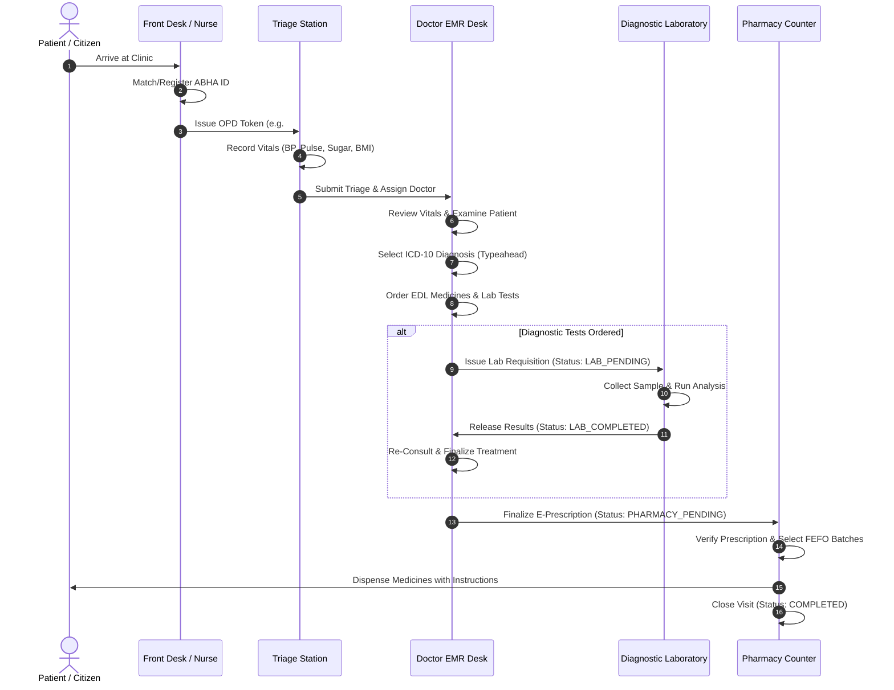

# 📖 Namma Clinic Digital Healthcare Network — User Manual & Operations Guide

**Version**: 2.4.0  
**Effective Date**: September 2026  
**Target Audience**: Medical Officers (Doctors), Staff Nurses, Pharmacists, Lab Technicians, District Health Officers, Facility Administrators, and Public Health Coordinators.  
**System Scope**: Urban Primary Health Centers (Namma Clinics / UHWCs), Rural Primary Clinics, Satellite Sub-Centers, Diagnostic Hubs, and Secondary/Tertiary Referral Hospitals.

---

## 📑 Table of Contents

1. [System Overview & Architecture](#1-system-overview--architecture)
2. [Access & Login Guide](#2-access--login-guide)
3. [User Roles & Security Permissions](#3-user-roles--security-permissions)
4. [Front Desk & Nursing Workflows](#4-front-desk--nursing-workflows)
   - 4.1 [Citizen Intake & ABHA Registration](#41-citizen-intake--abha-registration)
   - 4.2 [OPD Queue Management & Token Generation](#42-opd-queue-management--token-generation)
   - 4.3 [Clinical Triage & Vital Signs Recording](#43-clinical-triage--vital-signs-recording)
   - 4.4 [Assigning Patients to Attending Doctors](#44-assigning-patients-to-attending-doctors)
5. [Medical Officer (Doctor) Consultation Guide](#5-medical-officer-doctor-consultation-guide)
   - 5.1 [Doctor Clinical Dashboard & OPD Queue](#51-doctor-clinical-dashboard--opd-queue)
   - 5.2 [Starting an EMR Consultation](#52-starting-an-emr-consultation)
   - 5.3 [ICD-10 Diagnosis Search & Autocomplete](#53-icd-10-diagnosis-search--autocomplete)
   - 5.4 [E-Prescription Ordering (EDL List)](#54-e-prescription-ordering-edl-list)
   - 5.5 [Diagnostic Laboratory Requisitions](#55-diagnostic-laboratory-requisitions)
   - 5.6 [Raising Specialist Referrals](#56-raising-specialist-referrals)
   - 5.7 [Follow-up Scheduling & Completion](#57-follow-up-scheduling--completion)
6. [Laboratory Diagnostics Workflow](#6-laboratory-diagnostics-workflow)
   - 6.1 [Receiving Test Orders](#61-receiving-test-orders)
   - 6.2 [Sample Collection & Result Entry](#62-sample-collection--result-entry)
   - 6.3 [Doctor Re-Consultation Transition](#63-doctor-re-consultation-transition)
7. [Pharmacy & Dispensing Workflow](#7-pharmacy--dispensing-workflow)
   - 7.1 [Prescription Verification](#71-prescription-verification)
   - 7.2 [FEFO Batch Selection & Drug Dispensing](#72-fefo-batch-selection--drug-dispensing)
   - 7.3 [Medicine Master & Low-Stock Alerts](#73-medicine-master--low-stock-alerts)
8. [Public Health & Community Programs](#8-public-health--community-programs)
   - 8.1 [NCD Screening & Longitudinal Tracking](#81-ncd-screening--longitudinal-tracking)
   - 8.2 [Maternal & Child Health (ANC & Immunization)](#82-maternal--child-health-anc--immunization)
   - 8.3 [IDSP Communicable Disease Surveillance](#83-idsp-communicable-disease-surveillance)
   - 8.4 [Teleconsultation Sessions](#84-teleconsultation-sessions)
   - 8.5 [Community Outreach & Yoga/Wellness](#85-community-outreach--yogawellness)
9. [Administrative, Quality & Infrastructure Controls](#9-administrative-quality--infrastructure-controls)
   - 9.1 [Oxygen Cylinder & Facility Consumables](#91-oxygen-cylinder--facility-consumables)
   - 9.2 [Ward Bed Capacity & Allocation](#92-ward-bed-capacity--allocation)
   - 9.3 [Arogya Raksha Samiti (ARS) Governance](#93-arogya-raksha-samiti-ars-governance)
   - 9.4 [Kayakalp / NQAS Quality Audits](#94-kayakalp--nqas-quality-audits)
   - 9.5 [District Command Analytics & Export](#95-district-command-analytics--export)
10. [End-to-End Patient Journey Diagram](#10-end-to-end-patient-journey-diagram)
11. [FAQ & Troubleshooting](#11-faq--troubleshooting)

---

## 1. System Overview & Architecture

**Namma Clinic Digital Healthcare Network** is a unified, primary-care-first Electronic Medical Records (EMR) and public health operations platform designed to deliver high-quality, free, accessible primary healthcare across urban slums, rural taluks, and metropolitan districts.

### Key Pillars:
- **Zero-Drop Patient Flow**: Digital tokens guide citizens from front-desk triage to doctor consult, lab tests, pharmacy, and follow-ups without manual paper slips.
- **ABDM & ABHA Standards**: Instant matching and linking of patient records using Ayushman Bharat Health Account (ABHA) IDs.
- **Standardized Clinical Codification**: Standard ICD-10 diagnosis coding with smart typeahead search to ensure epidemiological accuracy.
- **FEFO Pharmacy Control**: First-Expiry-First-Out drug dispensing to prevent inventory wastage and eliminate expired medicine distribution.
- **Hierarchical Referral Network**: Transparent referral corridors connecting primary health centers to secondary general hospitals and tertiary super-speciality centers.

---

## 2. Access & Login Guide

### System Requirements:
- **Supported Browsers**: Google Chrome (v90+), Mozilla Firefox (v90+), Microsoft Edge (v90+), Apple Safari (v14+).
- **Recommended Resolution**: 1366 × 768 or higher (optimally responsive on laptops, desktops, and clinical tablets).
- **Default Application URLs**:
  - **Web Console**: `http://localhost:3000` (or your clinic's assigned domain).
  - **API Backend**: `http://localhost:8000/api/`.

### Logging In:
1. Navigate to the login page (`/login`).
2. Enter your assigned **Username** and **Password**.
3. Click **Sign in to Healthcare Console**.
4. Upon authentication, you will be directed to your role-specific dashboard.

> [!TIP]
> **Demo & Training Accounts**:
> - **Medical Officer (Doctor)**: Username: `doctor` | Password: `doctor123`
> - **Staff Nurse**: Username: `nurse` | Password: `nurse123`
> - **Pharmacist**: Username: `pharmacy` | Password: `pharmacy123`
> - **Lab Technician**: Username: `lab` | Password: `lab123`
> - **District Health Officer**: Username: `district` | Password: `district123`
> - **Hospital Administrator**: Username: `admin` | Password: `admin123`

---

## 3. User Roles & Security Permissions

Namma Clinic enforces strict **Role-Based Access Control (RBAC)** coupled with **Facility-Scope Isolation**. Users can only view and modify records within their authorized facility or district jurisdiction:

| Role | Primary Responsibilities | Accessible Key Modules |
| :--- | :--- | :--- |
| **Medical Officer (Doctor)** | Clinical consults, ICD-10 diagnoses, e-prescriptions, diagnostic lab requisitions, specialist referrals. | Dashboard, Consultation, Patients, Referrals, Follow-ups, Teleconsultation |
| **Staff Nurse** | Citizen intake, triage assessment, vital signs monitoring, OPD queue management, doctor assignment. | Patients, Queue, Triage, NCD, Maternal-Child, Outreach |
| **Pharmacist** | Prescription verification, FEFO batch dispensing, inventory replenishment, batch expiry alerts. | Pharmacy, Inventory, Medicine Master, Purchase Orders |
| **Lab Technician** | Test requisition intake, specimen collection, diagnostic analyzer results logging, abnormal result flagging. | Laboratory, Lab Test Master |
| **District Officer** | District command analytics, disease surveillance, referral bottlenecks, resource balancing. | District Dashboard, Reports, Surveillance, Network, Audit Logs |
| **Hospital Admin** | User account management, facility master data, ward bed allocation, infrastructure management. | Facilities, Staff, Infrastructure, ARS, Quality, Compliance |

---

## 4. Front Desk & Nursing Workflows

### 4.1 Citizen Intake & ABHA Registration (`/patients`)
1. Click **Patients** in the left navigation sidebar.
2. Check if the citizen already exists by entering their **Name**, **Phone Number**, or **ABHA ID** into the search bar.
3. If new, click **+ Register New Patient**:
   - **Full Name**, **Age**, and **Gender**.
   - **Contact Phone** and **Residential Address**.
   - **ABHA Health ID** (14-digit Ayushman Bharat identifier).
   - **Vulnerability Category**: General Citizen, Slum Resident, Migrant Worker, Elderly / PwD.
4. Click **Save Patient Record**. A unique permanent UHID (`NC-YYYYMMDD-XXX`) is automatically generated.

### 4.2 OPD Queue Management & Token Generation (`/queue`)
1. In the **OPD Queue** module, locate the patient.
2. Click **Generate OPD Token**:
   - Select **Visit Type**: `General OPD`, `NCD Follow-up`, `ANC Review`, or `Emergency`.
   - Select **Initial Priority**: `Normal`, `High`, or `Emergency`.
   - Select **Assigned Doctor**: Choose the duty doctor on shift (e.g. *Dr. Ananya Sharma*).
3. The system prints or displays a digital token (e.g., `#218`). The patient is placed in the `WAITING_FOR_TRIAGE` state.

### 4.3 Clinical Triage & Vital Signs Recording (`/triage`)
1. Navigate to the **Triage Desk** (`/triage`).
2. Select the patient token currently waiting for triage.
3. Record clinical baseline vitals:
   - **Systolic / Diastolic Blood Pressure** (mmHg) — *automatically flags hypertension if systolic ≥ 140 or diastolic ≥ 90*.
   - **Pulse Rate** (bpm) & **SpO2 Oxygen Saturation** (%).
   - **Body Temperature** (°F) & **Respiratory Rate** (/min).
   - **Random Blood Sugar (RBS)** (mg/dL) & **BMI** (computed from Height & Weight).
4. Enter the patient's **Chief Complaint** (e.g., *"Persistent dry cough & headache for 4 days"*).
5. Click **Submit Triage & Transfer to Doctor Queue**.
6. **System State Transition**: The patient immediately disappears from the triage pending queue and appears in the attending doctor's OPD queue as `WAITING_FOR_DOCTOR`.

---

## 5. Medical Officer (Doctor) Consultation Guide

### 5.1 Doctor Clinical Dashboard & OPD Queue (`/`)
When a Medical Officer logs in, the **Doctor Clinical Dashboard** presents:
- **Key Metric Cards**: Patients Waiting for Doctor, Total OPD Today, Pending Lab Requisitions, Scheduled Follow-ups.
- **My OPD Queue Table**: Real-time list of waiting triaged patients with Priority, Token #, Patient Name, Age, Waiting Time, Visit Type, Status, and Action.
- **"Call Next Patient" Quick Button**: Advances the highest-priority patient into the active consultation state.

### 5.2 Starting an EMR Consultation
1. Under the **Action** column in the OPD table, click the prominent **Consult** button (or **Re-Consult** if the patient completed diagnostic tests).
2. The system opens the **Doctor Consultation EMR Console** (`/consultation`) with all patient details, triage vitals, and previous medical history pre-loaded on screen.

### 5.3 ICD-10 Diagnosis Search & Autocomplete
The consultation form features a searchable **ICD-10 Diagnosis Code & Name** dropdown with live typeahead filtering:

```
[ Search by ICD code, disease name, or category... ]  [▼]
---------------------------------------------------------
Common Primary Care / OPD Diagnoses:
[E11.9]   Type 2 Diabetes Mellitus without Complications   (Endocrine)
[I10]     Essential (Primary) Hypertension                 (Cardiovascular)
[J06.9]   Acute Upper Respiratory Tract Infection (URTI)  (Respiratory)
[K29.7]   Gastritis, Unspecified                           (Gastrointestinal)
[A90]     Dengue Fever (Classic Dengue)                    (Infectious)
[M54.5]   Low Back Pain / Lumbago, Unspecified             (Musculoskeletal)
[N39.0]   Urinary Tract Infection (UTI)                    (Genitourinary)
```

#### How to Use:
1. **Browse Common Diagnoses**: Click the input field or the **▼** dropdown toggle to browse the most common primary-care diagnoses.
2. **Search by Disease Name**: Type any clinical keyword (e.g., `diab`, `hyper`, `fever`, `cough`, `asthma`, `headache`). The list filters instantaneously.
3. **Search by ICD-10 Code**: Type known codes like `E11`, `I10`, `J06`, `A90`, or `M54`.
4. **Keyboard Selection**: Use `ArrowDown` / `ArrowUp` to navigate matching options, and press `Enter` to select. Press `Escape` to close.
5. **Custom Diagnosis Support**: If a rare condition is treated that is not in the standard list, select **"+ Use custom: [typed text]"**. The system accepts the diagnosis and assigns general code `R69` without blocking your clinical workflow.
6. **Active Tag**: A blue tag `ICD: [CODE]` confirms the selected code.

### 5.4 E-Prescription Ordering (EDL List)
1. In the **Prescribe Medication** section, medications are pre-stocked from the clinic's Essential Drug List (EDL).
2. For each medication:
   - Select or edit the **Medicine Name** (e.g., `Metformin HCl 500 mg Tablet`, `Paracetamol 500 mg`).
   - Enter the **Dosage & Instructions** (e.g., `1-0-1 After Food`, `1-0-0 Morning Before Food`).
   - Enter the total **Quantity** to dispense (e.g., `28`).
3. Click **+ Add Medicine** to prescribe additional medications, or the **Trash** icon to remove an item.

### 5.5 Diagnostic Laboratory Requisitions
1. Under the **Laboratory Diagnostic Requisitions (14 Essential Tests)** panel, review the clinic's point-of-care lab tests.
2. Click on the desired tests to toggle their requisition status:
   - *Complete Blood Count (CBC)*, *Blood Glucose (Fasting/PP)*, *HbA1c*, *Lipid Profile*, *Urine Routine & Micro*, *Widal Test (Typhoid)*, *Dengue NS1 Antigen*, *Malaria Smear/RDT*, etc.
3. Selected tests highlight in bold teal with a checkmark.
4. Ordering diagnostic tests marks the visit as requiring laboratory processing before final discharge.

### 5.6 Raising Specialist Referrals
If the patient requires tertiary care or specialized surgical/medical management:
1. Check **Raise Cross-Facility Referral to Secondary/Specialist Hospital Hub**.
2. Select the **Destination Facility** (e.g., *KC General Hospital*, *Victoria Hospital*, *Bowring & Lady Curzon*).
3. Select **Urgency**: `Routine`, `Urgent`, or `Emergency`.
4. The system automatically populates the clinical summary with the recorded ICD-10 diagnosis and triage vitals.

### 5.7 Follow-up Scheduling & Completion
1. Specify a **Follow-up Date** (e.g., 7 or 14 days later).
2. Click **Complete Consultation & Issue Orders**.
3. Review the summary confirmation modal and click **Confirm**.
4. **Next Step**:
   - If **Lab Tests Were Ordered**: Visit status becomes `LAB_PENDING`. The patient proceeds to the clinic lab.
   - If **Only Medications Were Prescribed**: Visit status becomes `PHARMACY_PENDING`. The patient proceeds to the pharmacy.

---

## 6. Laboratory Diagnostics Workflow

### 6.1 Receiving Test Orders (`/lab`)
1. The Lab Technician logs in and opens the **Laboratory Console** (`/lab`).
2. Pending requisitions appear with patient token, test names, and requesting doctor.
3. Click **Collect Specimen** once blood/urine/swab sample is received and labeled.

### 6.2 Sample Collection & Result Entry
1. After running analysis on point-of-care equipment:
   - Enter the numerical or qualitative **Observed Result**.
   - Review the automatic **Reference Range Validation** (green for normal, red warning for abnormal/critical).
   - Enter technician remarks if necessary.
2. Click **Verify & Release Lab Findings**.

### 6.3 Doctor Re-Consultation Transition
- Releasing all ordered tests automatically transitions the visit status to `LAB_COMPLETED` (tagged **LAB READY**).
- On the Doctor's Dashboard, the patient row highlights in bold purple with a **Re-Consult** button.
- When the doctor re-opens the visit, previous notes, prescriptions, and lab findings are displayed side-by-side for final therapy decisions.

---

## 7. Pharmacy & Dispensing Workflow

### 7.1 Prescription Verification (`/pharmacy`)
1. The Pharmacist navigates to the **Pharmacy** desk.
2. Active e-prescriptions appear categorized by status (`PENDING`, `DISPENSED`, `REJECTED`).
3. Click on a pending prescription to view:
   - Prescribing Doctor and Date.
   - Prescribed medications, dosage instructions, and requested quantities.
   - Patient allergy warnings and NCD flags.

### 7.2 FEFO Batch Selection & Drug Dispensing
Namma Clinic strictly enforces **First-Expiry-First-Out (FEFO)** dispensing:
1. For each prescribed drug, the system displays available batches sorted by earliest expiration date.
2. The batch with the closest expiry date is selected by default to minimize inventory shelf expiration.
3. Review quantity and click **Confirm Dispense & Deduct Stock**.
4. The system:
   - Automatically deducts the dispensed count from the batch ledger.
   - Updates the visit status to `COMPLETED`.
   - Generates a printable dispensing slip with vernacular dosage instructions.

### 7.3 Medicine Master & Low-Stock Alerts
- View stock levels, batch numbers, and reorder levels in real time.
- Batches expiring within 60 days are flagged with yellow warning badges; expired batches are locked from dispensing.
- Low-stock alerts appear in the District Command Center to trigger automated purchase orders.

---

## 8. Public Health & Community Programs

### 8.1 NCD Screening & Longitudinal Tracking (`/ncd`)
- Chronic disease registry for **Hypertension**, **Type 2 Diabetes**, **Cardiovascular Disease**, and **Oral/Breast/Cervical Cancers**.
- Tracks longitudinal blood pressure graphs, fasting glucose, and compliance scores over months.
- Automatically flags patients with high systolic pressure (>140 mmHg) for immediate review.

### 8.2 Maternal & Child Health (ANC & Immunization) (`/maternal-child`)
- **Antenatal Care (ANC)**: Register expected delivery date (EDD), track 4 mandatory ANC check-ups, maternal hemoglobin, Td boosters, and high-risk pregnancy flags.
- **Universal Immunization Programme (UIP)**: Child vaccination scheduler tracking BCG, OPV, Pentavalent, Rotavirus, MR, and DPT boosters from birth to 5 years.

### 8.3 IDSP Communicable Disease Surveillance (`/surveillance`)
- Real-time syndromic surveillance aligned with Integrated Disease Surveillance Programme (IDSP) Form S & P.
- Automatically aggregates cluster cases of **Dengue**, **Typhoid**, **Malaria**, **Acute Diarrheal Disease (ADD)**, and **Acute Respiratory Infections (ARI)**.
- Generates geographic ward-level outbreak alert thresholds.

### 8.4 Teleconsultation Sessions (`/teleconsultation`)
- Connects local clinic patients with district specialist doctors (Cardiologists, Dermatologists, Pediatricians, OB-GYN).
- Enables real-time video/audio streaming, screen-sharing of diagnostic reports, and digital co-signature of prescriptions.

### 8.5 Community Outreach & Yoga/Wellness (`/outreach` & `/wellness`)
- **Outreach**: Log health camps, school health screenings, and ASHA worker door-to-door survey syncs.
- **Wellness**: Track mandatory weekly Yoga and lifestyle counseling sessions conducted at Urban Health and Wellness Centers.

---

## 9. Administrative, Quality & Infrastructure Controls

### 9.1 Oxygen Cylinder & Facility Consumables (`/infrastructure`)
- Real-time pressure gauge logging for clinical medical oxygen cylinders (Type D & B).
- Consumables monitoring: surgical gloves, syringes, sanitizers, rapid test kits.
- Electrical, plumbing, and IT equipment maintenance ticket tracker.

### 9.2 Ward Bed Capacity & Allocation
- Real-time monitoring of day-care beds and observation cots.
- Prevents double-booking and tracks bed occupancy hours.

### 9.3 Arogya Raksha Samiti (ARS) Governance (`/ars`)
- Committee meeting minutes documentation, untied fund allocations, and financial transparency ledger.

### 9.4 Kayakalp / NQAS Quality Audits (`/quality`)
- Standardized 100-point hygiene, sanitation, infection control, and bio-medical waste segregation checklists.

### 9.5 District Command Analytics & Export (`/reports`)
- Executive dashboard showing district-wide clinic footfall, disease prevalence, referral ratios, and pharmacy burn rates.
- One-click export to CSV/Excel for state health reporting.

---

## 10. End-to-End Patient Journey Diagram



---

## 11. FAQ & Troubleshooting

### Q1: What should I do if a patient arrives in critical condition?
**Ans**: At the Front Desk or Triage desk, select the priority **Emergency (Red)**. The patient automatically jumps to the top of the Doctor's OPD queue with an urgent visual banner.

### Q2: How do I handle a patient diagnosis that is not in the ICD-10 dropdown?
**Ans**: Simply type the name of the diagnosis into the **ICD-10 Diagnosis Code & Name** field and click **"+ Use custom: [typed text]"**. The system will record your exact diagnosis text and assign code `R69` (Illness, unspecified) so your consultation is never held up.

### Q3: What happens if a prescribed medicine is out of stock in the clinic?
**Ans**: If a batch has zero quantity, the system will highlight the stock-out and suggest verified therapeutic equivalents from the clinic's Essential Drug List (EDL).

### Q4: Can a patient be transferred to another doctor during the same shift?
**Ans**: Yes. Staff Nurses and Doctors can change the assigned doctor in the **Queue Management** screen (`/queue`) by selecting the token and choosing another available doctor from the dropdown.

### Q5: Who do I contact for technical support or user credential issues?
**Ans**: Contact your facility system administrator or email the district technical desk at `support.nammaclinic@health.gov.in`.
