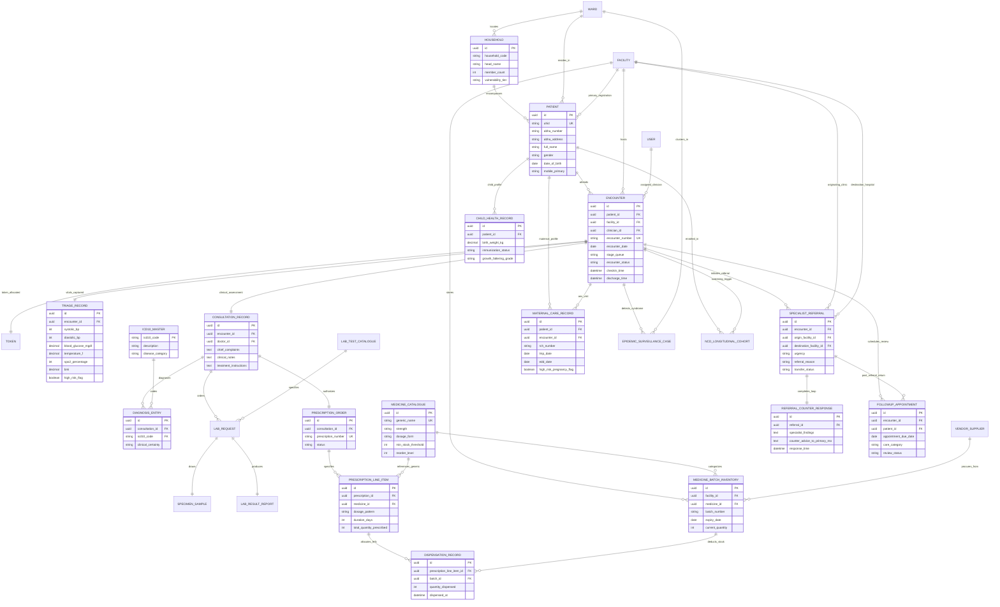

# Namma Clinic — Target Data Model Proposal

> **DOCUMENT CLASSIFICATION**: PROPOSED ARCHITECTURE — NOT YET IMPLEMENTED  
> **PURPOSE**: Technical specification for the future data model refactoring to eliminate dashboard discrepancies, integrate orphaned modules, establish strict referential integrity, and provide a unified operational-to-analytical pipeline.

---

## 1. Architectural Principles of the Target Model

1. **Strict Relational Traceability**:
   Every clinical action (triage, diagnosis, lab order, prescription item, referral, and follow-up) must branch directly from a single core `Encounter` (`Visit`) record.
2. **Foreign Key Referential Integrity for Prescriptions**:
   `PrescriptionItem` must reference `MedicineMaster` directly via Foreign Key, ensuring unambiguous inventory lookup and preventing drug name typographical errors.
3. **Integration of Maternal & Child RCH**:
   Register and migrate `MaternalRecord` and `ChildRecord` into the core schema, linking them to `Patient` and `Encounter`.
4. **Dynamic Event-Driven Public Health**:
   `DiseaseCase` and `NCDRecord` must be derived automatically from `Consultation` (ICD-10 codes) and `TriageVitals` (elevated blood pressure and blood glucose values), eliminating detached standalone records.
5. **Separation of Operational OLTP and Analytical Aggregates**:
   Implement database views / materialized aggregates for DHO dashboards to prevent costly table scans, eliminate client-side pagination errors, and discard hardcoded fallback values.

---

## 2. Proposed Target Data Model Architecture

```
+-----------------------------------------------------------------------------------+
|                            OPERATIONAL LAYER (OLTP)                               |
|                                                                                   |
|  [Citizen / Patient]                                                              |
|         |                                                                         |
|         v                                                                         |
|  [Encounter (Visit)] <---------- [OPD Priority Token]                             |
|         |                                                                         |
|         +---> [Triage Vitals] ---------> [Dynamic Clinical Risk Flag Trigger]     |
|         |                                                                         |
|         +---> [Consultation / EMR] ----> [ICD-10 Master Coding]                   |
|         |           |                                                             |
|         |           +---> [Lab Order] -> [Specimen Barcode] -> [Verified Result]  |
|         |           |                                                             |
|         |           +---> [Prescription] -> [Prescription Item (FK Medicine)]     |
|         |           |                                     |                       |
|         |           |                                     v                       |
|         |           |                       [FEFO Batch Allocation Ledger]        |
|         |           |                                                             |
|         |           +---> [Closed-Loop Specialist Referral]                       |
|         |                                                                         |
|         +---> [Scheduled Follow-Up Review]                                        |
+-----------------------------------------------------------------------------------+
                                          |
                                          | Trigger / View Materialization
                                          v
+-----------------------------------------------------------------------------------+
|                           ANALYTICS & REPORTING LAYER                             |
|                                                                                   |
|  +---------------------------+  +--------------------------+                      |
|  | Daily Clinic Aggregates   |  | Ward Epidemic Surveillance|                      |
|  | - Footfall & Queues       |  | - 7-Day Fever Cluster Map|                      |
|  | - Consultations by ICD-10 |  | - Threshold Anomaly Score|                      |
|  | - Completed Referrals     |  +--------------------------+                      |
|  +---------------------------+                                                    |
|                |                                                                  |
|                v                                                                  |
|  +---------------------------------------------------------+                      |
|  | DHO & Executive Command Centre Dashboards               |                      |
|  | - 100% Database-Derived Metrics (Zero Hardcoding)       |                      |
|  | - Multi-Tier District -> Zone -> Ward -> Clinic Drill-down|                     |
|  +---------------------------------------------------------+                      |
+-----------------------------------------------------------------------------------+
```

---

## 3. Proposed Target ERD

> **LABEL**: PROPOSED — NOT YET IMPLEMENTED



---

## 4. Operational Transition & Migration Strategy

1. **Step 1 — Entity Normalization**:
   - Introduce `ICD10Master` and convert string-based diagnosis codes to normalized relations.
   - Refactor `PrescriptionItem` to enforce `medicine_id` foreign key against `MedicineMaster`.
2. **Step 2 — Encounter Anchoring**:
   - Add `encounter_id` foreign key to `Referral` and `FollowUp`.
3. **Step 3 — RCH Module Activation**:
   - Register `apps.maternal` and `apps.child` in `INSTALLED_APPS`, generate migration files, and connect serializers to `Patient` and `Encounter`.
4. **Step 4 — View Materialization for Dashboards**:
   - Create SQL views for DHO aggregate footfall, low stock, and referral statistics to eliminate client-side slicing and backend fallbacks.
