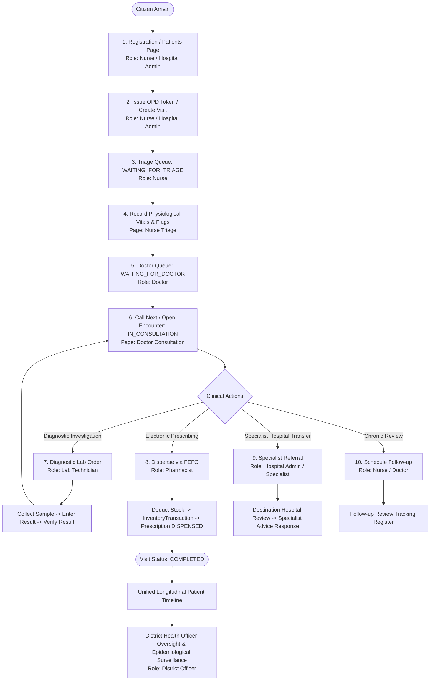

# Namma Clinic — End-to-End Master Business Flow & Cross-Role Handoff Map

## 1. Master Clinical Business Flow



---

## 2. Transition Specifications

Every state transition in the primary healthcare journey is defined by the following contract:
`Current State → User Action → API → Database State → UI State → Next Role/Page`

### Step 1: Citizen Arrival → Patient Registration
- **Current State**: Unregistered citizen arrives at clinic.
- **User Action**: Nurse opens `/patients` → clicks "Register Patient" → enters demographics.
- **API Called**: `POST /api/patients/`
- **Database State**: `Patient` created with unique sequential UHID (e.g. `NC-KA-2026-XXXX`), linked to registration facility and district.
- **UI State**: Modal confirms registration; patient appears in registered patient table.
- **Next Step**: Click "Issue Daily Token" on the patient row.

### Step 2: Patient Registered → OPD Token Issued
- **Current State**: Patient registered in master directory; no active visit for today.
- **User Action**: Nurse clicks "Issue Daily Token" → selects Visit Type (`GENERAL_OPD`) → clicks "Generate Token".
- **API Called**: `POST /api/visits/`
- **Database State**:
  - `Visit` created (`status: 'WAITING_FOR_TRIAGE'`, `current_queue: 'TRIAGE'`).
  - `Token` generated with sequential daily number (e.g. Token #4).
  - `VisitStatusHistory` logs `TRANSITION: ARRIVAL_TOKEN_GENERATED`.
- **UI State**: Token confirmation alert; visit appears in `/queue` under Triage tab.
- **Next Step**: Nurse opens `/triage`.

### Step 3: Triage Queue → Nurse Vitals Assessment
- **Current State**: Visit in `TRIAGE` queue with status `WAITING_FOR_TRIAGE`.
- **User Action**: Nurse selects patient on `/triage` → logs BP, pulse, temp, SpO2, glucose, height, weight → clicks "Log Nurse Triage & Forward".
- **API Called**: `POST /api/triage/`
- **Database State**:
  - `TriageVitals` created with risk flags (`high_bp_flag`, `high_glucose_flag`, `fever_flag`).
  - `Visit` status automatically updated to `WAITING_FOR_DOCTOR`, `current_queue: 'DOCTOR'`.
  - `VisitStatusHistory` logs triage completion.
- **UI State**: Success alert displayed.
- **Next Step**: Nurse returns to `/queue` (or remains on `/triage` with queue refreshed).

### Step 4: Doctor Queue → Doctor Consultation
- **Current State**: Visit in `DOCTOR` queue with status `WAITING_FOR_DOCTOR`.
- **User Action**: Doctor clicks "Call Next Waiting Patient" (or selects patient from `/consultation`).
- **API Called**: `POST /api/visits/call-next/` with payload `{'queue': 'DOCTOR'}`.
- **Database State**: `Visit.status` becomes `IN_CONSULTATION`.
- **UI State**: Patient marked active in consultation; pre-recorded triage vitals and clinical warning flags populate form.
- **Next Step**: Doctor enters chief complaint, clinical examination, ICD diagnosis, prescription items, lab orders, referral, and follow-up.

### Step 5: Doctor Consultation → E-Prescription & Orders Issued
- **Current State**: Doctor completes clinical evaluation.
- **User Action**: Doctor clicks "Complete Consultation & Save".
- **API Called**:
  - `POST /api/consultations/` (includes `prescription_items`)
  - `POST /api/lab/orders/` (if diagnostic investigations ordered)
  - `POST /api/referrals/` (if specialist referral initiated)
  - `POST /api/followups/` (if review appointment scheduled)
- **Database State**:
  - `Consultation` created with ICD code and clinical notes.
  - `Prescription` created (`status: 'ACTIVE'`) with associated `PrescriptionItem` records (`status: 'PENDING'`).
  - `Visit.current_queue` automatically updated to `PHARMACY`, `status: 'WAITING_FOR_PHARMACY'` (or `COMPLETED` if no medicines prescribed).
- **UI State**: Doctor redirected to `/queue`.
- **Next Step**: Pharmacist opens `/pharmacy` to dispense prescribed medicines.

### Step 6: Pharmacy Queue → FEFO Medicine Dispensing
- **Current State**: Prescription in `ACTIVE` state with items `PENDING`; visit in `WAITING_FOR_PHARMACY`.
- **User Action**: Pharmacist opens `/pharmacy` → selects prescription → clicks "Dispense Medicines (FEFO)".
- **API Called**: `POST /api/pharmacy/dispense/`
- **Database State**:
  - System selects earliest expiry batch (`MedicineBatch`) for each medicine.
  - Decrements batch quantity in real time.
  - Inserts `InventoryTransaction` records (`type: 'DISPENSED'`, `reference_id: 'PRESCR-<id>'`).
  - Updates `PrescriptionItem.status` to `DISPENSED`.
  - Updates `Prescription.status` to `DISPENSED`.
  - Updates `Visit.status` to `COMPLETED`, `current_queue: 'COMPLETED'`.
- **UI State**: Real-time stock ledger decrements; prescription moves to dispensed archive.
- **Next Step**: Visit cycle complete. All encounter records reflected on Patient Longitudinal Timeline.

---

## 3. Cross-Role Handoff Validation

| Handoff Stage | Producing Role | Consuming Role | Interface Artifact | Validation Result | Evidence |
|---|---|---|---|---|---|
| **Nurse → Doctor** | `NURSE` | `DOCTOR` | `Visit` (`current_queue: DOCTOR`) + `TriageVitals` | **PASS** | Doctor immediately sees triaged patient in OPD queue with real-time BP, pulse, and glucose flags. |
| **Doctor → Lab** | `DOCTOR` | `LAB_TECHNICIAN` | `LabOrder` (`status: ORDERED`) | **PASS** | Lab technician dashboard displays pending order with patient demographics and requested test master. |
| **Lab → Doctor** | `LAB_TECHNICIAN` | `DOCTOR` | `LabResult` (`status: COMPLETED` / `VERIFIED`) | **PASS** | Doctor inspects verified diagnostic result (value, unit, reference range, critical flags) directly in EMR. |
| **Doctor → Pharmacy** | `DOCTOR` | `PHARMACIST` | `Prescription` (`status: ACTIVE`) + `PrescriptionItem` | **PASS** | Pharmacist console displays pending prescription with dosages, durations, and quantities. |
| **Pharmacy → Patient** | `PHARMACIST` | `PATIENT` / `EMR` | `InventoryTransaction` + `Prescription` (`DISPENSED`) | **PASS** | Stock decrements with FEFO batch lineage; patient longitudinal timeline records dispensing event. |
| **Doctor → Referral** | `DOCTOR` | `HOSPITAL_ADMIN` / Specialist | `Referral` (`urgency: ROUTINE/URGENT/EMERGENCY`) | **PASS** | Destination hospital specialist views incoming referral and responds with specialist findings. |
| **Doctor → Follow-up** | `DOCTOR` | `NURSE` / `DOCTOR` | `FollowUp` (`status: PENDING`, `due_date`) | **PASS** | Scheduled review appears on Chronic Follow-up register and alerts when due. |
| **Clinical → DHO** | All Facility Clinicians | `DISTRICT_OFFICER` | Public Health Aggregation & Timeline | **PASS** | DHO dashboard aggregates OPD volume, NCD prevalence, surveillance alerts, and stock balances in real time. |

---

## 4. State Machine Verification

### A. OPD Queue State Machine
```
[WAITING_FOR_TRIAGE] (Queue: TRIAGE)
        ↓  (Nurse logs vitals)
[WAITING_FOR_DOCTOR] (Queue: DOCTOR)
        ↓  (Doctor calls patient)
[IN_CONSULTATION]   (Queue: DOCTOR)
        ↓  (Doctor saves consultation with Rx)
[WAITING_FOR_PHARMACY] (Queue: PHARMACY)
        ↓  (Pharmacist dispenses)
[COMPLETED]         (Queue: COMPLETED)
```
- **Invariant**: `Visit.status` and `Visit.current_queue` remain 100% synchronized across all transitions.

### B. Prescription State Machine
```
[ACTIVE] (Items: PENDING)
        ↓  (Pharmacist dispenses via FEFO)
[DISPENSED] (Items: DISPENSED)
```
- **Invariant**: Header status cannot become `DISPENSED` while any items remain `PENDING`. Re-dispensing already dispensed items is blocked.

### C. Laboratory State Machine
```
[ORDERED]
        ↓  (Technician collects specimen)
[SAMPLE_COLLECTED] (LabSample created with barcode)
        ↓  (Technician enters & verifies result)
[COMPLETED] (LabResult created with verification timestamp)
```
- **Invariant**: Only authorized `LAB_TECHNICIAN` role can verify and release diagnostic results to EMR.

### D. Referral Urgency State Machine
- **Allowed Values**: `ROUTINE`, `URGENT`, `EMERGENCY`.
- **Status Progression**: `PENDING` → `ACCEPTED` / `REJECTED` → `COMPLETED` (via `ReferralResponse`).

---

## 5. Controlled Demo Patient Journey Trace Schema

During controlled validation, test citizen **Anand Varma** was traced across all 13 clinical touchpoints:

| Stage # | Stage Name | Entity Type | Database Record ID | Business Identifier | Verified Status |
|---|---|---|---|---|---|
| 1 | Patient Registration | `Patient` | `ID: 639` | `UHID: NC-KA-2026-8262` | Registered |
| 2 | Visit / Token Creation | `Visit`, `Token` | `Visit ID: 163`, `Token ID: 163` | `UID: VIS-F112-20260921-004`, `Token: #4` | `WAITING_FOR_TRIAGE` |
| 3 | Nurse Triage | `TriageVitals` | `ID: 99` | `BP: 148/96, Pulse: 82, Gluc: 175` | `WAITING_FOR_DOCTOR` |
| 4 | Doctor Consultation | `Consultation` | `ID: 74` | `ICD: I10 / E11.9 (HTN & DM)` | `IN_CONSULTATION` |
| 5 | Electronic Prescription | `Prescription` | `ID: 74` | 2 Items: Metformin 500mg, Amlodipine 5mg | `WAITING_FOR_PHARMACY` |
| 6 | Lab Investigation Order | `LabOrder` | `ID: 55` | Test: Fasting Blood Sugar | `ORDERED` |
| 7 | Specimen Collection | `LabSample` | `ID: 53` | Barcode: `SMP-0055` | `SAMPLE_COLLECTED` |
| 8 | Lab Result Verification | `LabResult` | `ID: 53` | Value: `168.0 mg/dL` (`HIGH`) | `COMPLETED` |
| 9 | Specialist Referral | `Referral` | `ID: 41` | `REF-20260921-0003` to Victoria Hospital | `ROUTINE` |
| 10 | Chronic Follow-up | `FollowUp` | `ID: 33` | Due: 2026-10-05 (14 days) | `PENDING` |
| 11 | Pharmacy FEFO Dispensing | `InventoryTransaction` | `Tx IDs: 54, 55` | Batch Metformin: 28, Batch Amlodipine: 14 | `DISPENSED` |
| 12 | Visit Completion | `Visit` | `ID: 163` | `status: COMPLETED`, `queue: COMPLETED` | `COMPLETED` |
| 13 | Longitudinal Timeline | `PatientTimeline` | 8 Events | Chronological event stream from Reg to Rx | Verified on DHO & EMR |
