# Namma Clinic — Current Implementation ERD

> **STATUS**: CURRENT IMPLEMENTATION (AS-IS REPOSITORY SCHEMA)  
> **NOTE**: This diagram accurately represents the existing operational models in the codebase as of commit `483e80a`. It does not include unmigrated/orphaned models (`child`, `maternal`) or hypothetical future entities.

```mermaid
erDiagram
    %% Geography & Infrastructure
    STATE ||--o{ DISTRICT : "contains"
    DISTRICT ||--o{ ZONE : "contains"
    ZONE ||--o{ WARD : "contains"
    DISTRICT ||--o{ FACILITY : "administers"
    WARD ||--o{ FACILITY : "locates"
    FACILITY ||--o{ FACILITY : "parent_to_child"
    FACILITY ||--o{ FACILITY_RELATIONSHIP : "source_node"
    FACILITY ||--o{ FACILITY_RELATIONSHIP : "destination_node"

    %% Users & Accounts
    FACILITY ||--o{ USER : "assigns"
    DISTRICT ||--o{ USER : "assigns"

    %% Facility Infrastructure
    FACILITY ||--o{ OXYGEN_SUPPLY : "monitors"
    FACILITY ||--o{ CONSUMABLE_INVENTORY : "stocks"
    FACILITY ||--o{ MAINTENANCE_TICKET : "logs"
    FACILITY ||--o{ BED_CAPACITY : "tracks"
    FACILITY ||--o{ BED_ALLOCATION : "allocates"

    %% Patient Master & Encounter Journey
    FACILITY ||--o{ PATIENT : "registers"
    WARD ||--o{ PATIENT : "resides_in"
    WARD ||--o{ HOUSEHOLD : "locates"
    PATIENT ||--o{ PATIENT_DOCUMENT : "owns"
    PATIENT ||--o{ BED_ALLOCATION : "occupies"
    
    PATIENT ||--o{ VISIT : "undertakes"
    FACILITY ||--o{ VISIT : "hosts"
    USER ||--o{ VISIT : "assigned_doctor"
    
    VISIT ||--|| TOKEN : "issues"
    VISIT ||--|| TRIAGE_VITALS : "captures"
    VISIT ||--|| CONSULTATION : "conducts"
    VISIT ||--o{ VISIT_STATUS_HISTORY : "tracks"

    %% Clinical Care, Diagnostics & Prescriptions
    CONSULTATION ||--|| PRESCRIPTION : "generates"
    PRESCRIPTION ||--o{ PRESCRIPTION_ITEM : "contains"
    
    CONSULTATION ||--o{ LAB_ORDER : "requests"
    LAB_TEST_MASTER ||--o{ LAB_ORDER : "specifies"
    LAB_ORDER ||--|| LAB_SAMPLE : "collects"
    LAB_ORDER ||--|| LAB_RESULT : "produces"

    %% Pharmacy & Inventory
    FACILITY ||--o{ MEDICINE_BATCH : "holds_stock"
    MEDICINE_MASTER ||--o{ MEDICINE_BATCH : "categorizes"
    VENDOR ||--o{ MEDICINE_BATCH : "supplies"
    VENDOR ||--o{ PURCHASE_ORDER : "receives_po"
    PURCHASE_ORDER ||--o{ PURCHASE_ORDER_ITEM : "specifies"
    MEDICINE_MASTER ||--o{ PURCHASE_ORDER_ITEM : "orders"
    FACILITY ||--o{ INVENTORY_TRANSACTION : "records"
    MEDICINE_MASTER ||--o{ INVENTORY_TRANSACTION : "transacts"

    %% Referrals, Follow-ups & Public Health
    PATIENT ||--o{ REFERRAL : "referred_for"
    FACILITY ||--o{ REFERRAL : "source"
    FACILITY ||--o{ REFERRAL : "destination"
    REFERRAL ||--|| REFERRAL_RESPONSE : "returns_loop"
    
    PATIENT ||--o{ FOLLOW_UP : "monitors"
    REFERRAL ||--o{ FOLLOW_UP : "originates_from"
    VISIT ||--o{ FOLLOW_UP : "schedules_review"
    
    PATIENT ||--o{ NCD_RECORD : "screened"
    FACILITY ||--o{ NCD_RECORD : "conducts_screening"
    
    PATIENT ||--o{ DISEASE_CASE : "reported_for"
    FACILITY ||--o{ DISEASE_CASE : "detects"
    WARD ||--o{ DISEASE_CASE : "ward_cluster"

    %% Governance, Alerts & Auditing
    FACILITY ||--o{ ARS_MEETING : "hosts_samithi"
    FACILITY ||--o{ ARS_MEMBER : "members"
    ARS_MEETING ||--o{ ARS_ACTION_ITEM : "resolves"
    FACILITY ||--o{ QUALITY_CHECKLIST : "audited"
    FACILITY ||--o{ BIOMEDICAL_WASTE_LOG : "disposes"
    FACILITY ||--o{ ALERT : "triggers"
    FACILITY ||--o{ AUDIT_LOG : "audited_at"

    %% Entity Details
    STATE {
        int id PK
        string name
        string code
    }

    DISTRICT {
        int id PK
        int state_id FK
        string name
        string code
    }

    ZONE {
        int id PK
        int district_id FK
        string name
        string code
    }

    WARD {
        int id PK
        int zone_id FK
        int ward_number
        string name
        int population
        int slum_population
    }

    FACILITY {
        int id PK
        int parent_facility_id FK
        int district_id FK
        int ward_id FK
        string facility_code
        string facility_name
        string facility_type
        int bed_capacity
    }

    FACILITY_RELATIONSHIP {
        int id PK
        int source_facility_id FK
        int destination_facility_id FK
        string relationship_type
        decimal distance_km
    }

    USER {
        int id PK
        int assigned_facility_id FK
        int assigned_district_id FK
        string username
        string role
        string full_name
    }

    PATIENT {
        int id PK
        int registered_at_facility_id FK
        int ward_id FK
        string patient_id
        string name
        string mobile
        string ABHA_ID_DEMO
        string vulnerability_information
    }

    VISIT {
        int id PK
        int patient_id FK
        int facility_id FK
        int assigned_doctor_id FK
        string visit_id
        date opd_date
        string current_queue
        string status
    }

    TOKEN {
        int id PK
        int visit_id FK
        int facility_id FK
        int token_number
        date date
        string status
    }

    TRIAGE_VITALS {
        int id PK
        int visit_id FK
        int patient_id FK
        int blood_pressure_systolic
        int blood_pressure_diastolic
        int blood_glucose_mgdl
        bool high_bp_flag
        bool high_glucose_flag
    }

    CONSULTATION {
        int id PK
        int visit_id FK
        int patient_id FK
        int doctor_id FK
        string diagnosis_code
        string diagnosis_name
        text clinical_notes
    }

    PRESCRIPTION {
        int id PK
        int consultation_id FK
        int patient_id FK
        date date
        string status
    }

    PRESCRIPTION_ITEM {
        int id PK
        int prescription_id FK
        string medicine_name
        int quantity
        string status
    }

    LAB_TEST_MASTER {
        int id PK
        string code
        string name
        string reference_range
    }

    LAB_ORDER {
        int id PK
        int consultation_id FK
        int patient_id FK
        int test_master_id FK
        string status
    }

    LAB_SAMPLE {
        int id PK
        int lab_order_id FK
        string sample_code
        string sample_type
    }

    LAB_RESULT {
        int id PK
        int lab_order_id FK
        string result_value
        string interpretation_flag
    }

    MEDICINE_MASTER {
        int id PK
        string generic_name
        int reorder_level
    }

    MEDICINE_BATCH {
        int id PK
        int facility_id FK
        int medicine_id FK
        string batch_number
        date expiry_date
        int quantity
        string status
    }

    REFERRAL {
        int id PK
        int patient_id FK
        int source_facility_id FK
        int destination_facility_id FK
        string referral_id
        string urgency
        string status
    }

    REFERRAL_RESPONSE {
        int id PK
        int referral_id FK
        text specialist_findings
        text return_advice
    }

    FOLLOW_UP {
        int id PK
        int patient_id FK
        int referral_id FK
        int visit_id FK
        date due_date
        string status
    }

    NCD_RECORD {
        int id PK
        int patient_id FK
        int facility_id FK
        bool hypertension_diagnosed
        bool diabetes_diagnosed
        string risk_level
        string control_status
    }

    DISEASE_CASE {
        int id PK
        int patient_id FK
        int facility_id FK
        int ward_id FK
        string disease_name
        string severity
        string status
    }
```

---

## Key Structural Observations from the Current ERD

1. **Tight Clinical Core**: `Visit` $\rightarrow$ `Token`, `Visit` $\rightarrow$ `TriageVitals`, and `Visit` $\rightarrow$ `Consultation` $\rightarrow$ `Prescription` form an unambiguous 1:1 chain.
2. **Missing Clinical Junctions**:
   - `PrescriptionItem` stores `medicine_name` as a string and has no foreign key to `MedicineMaster` or `MedicineBatch`.
   - `Referral` has foreign keys to `Patient`, `source_facility`, and `destination_facility`, but **lacks a foreign key to `Visit` or `Consultation`**.
   - `NCDRecord` links to `Patient` and `Facility`, but **does not link to `Visit` or `TriageVitals`**.
   - `DiseaseCase` links to `Patient`, `Facility`, and `Ward`, but **does not link to `Consultation` or `LabOrder`**.
