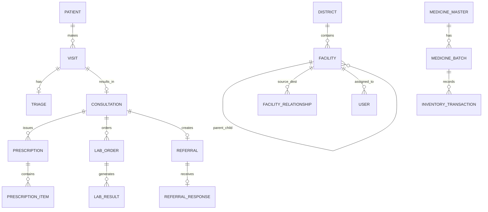

# Database Schema Documentation
## Namma Clinic Integrated Digital Healthcare Network

The database is built on SQLite using Django ORM as the primary schema source. The schema is exported to `database/db.sql`.

### Core Entities & Relationships

### Table Definitions Summary
1. `users`: Standard user credentials, full name, role (`SUPER_ADMIN`, `DISTRICT_ADMIN`, `HOSPITAL_ADMIN`, `MEDICAL_OFFICER`, `STAFF_NURSE`, `LAB_TECHNICIAN`, `PHARMACIST`, `LDC`, `PUBLIC_HEALTH_OFFICER`), assigned facility ID.
2. `facilities`: Facility code, name, type (`MAIN_HOSPITAL`, `REFERRAL_HOSPITAL`, `UPHC`, `NAMMA_CLINIC`, `URBAN_CLINIC`, `RURAL_CLINIC`, `VILLAGE_CLINIC`, `DIAGNOSTIC_CENTER`), parent facility, district, zone, ward, population served, services available, coordinate latitude/longitude.
3. `facility_relationships`: Source facility, destination facility, relationship type (`PARENT`, `REFERRAL`, `SPECIALIST`, `EMERGENCY`, `DIAGNOSTIC`, `TELECONSULTATION`), priority, distance km.
4. `patients`: Patient ID (`NC-YYYYMMDD-XXXX`), name, DOB/age, gender, mobile, address, ward, district, ABHA_ID_DEMO, emergency contact, vulnerability flags.
5. `visits`: Visit ID, patient, facility, visit date, visit type, status (`WAITING`, `TRIAGED`, `IN_CONSULTATION`, `COMPLETED`, `CANCELLED`), token number.
6. `triage`: Visit, BP Systolic/Diastolic, Pulse, Temperature, SpO2, Resp Rate, Height, Weight, BMI, Glucose, Risk flags (High BP, High Glucose, Fever, Low SpO2, High Risk Pregnancy).
7. `consultations`: Visit, patient, doctor, chief complaint, clinical summary, diagnosis ICD/text, treatment plan, follow-up date.
8. `prescriptions`: Consultation, patient, doctor, facility, date, status.
9. `prescription_items`: Prescription, medicine master, dosage, frequency, duration days, quantity, status (`PENDING`, `DISPENSED`).
10. `lab_orders`: Consultation, patient, doctor, test master, status (`ORDERED`, `SAMPLE_COLLECTED`, `RESULT_ENTRY`, `VERIFIED`).
11. `lab_results`: Lab order, result value, reference range, status, verified by.
12. `medicines`: Generic name, brand name, strength, unit, category, reorder level.
13. `medicine_batches`: Medicine, batch number, supplier, received date, expiry date, quantity, status (`ACTIVE`, `LOW_STOCK`, `EXPIRED`).
14. `referrals`: Referral ID (`REF-XXXX`), patient, source facility, destination facility, referring doctor, urgency, reason, clinical summary, status (`CREATED`, `ACCEPTED`, `UNDER_TREATMENT`, `COMPLETED`).
15. `referral_responses`: Referral, hospital doctor, specialist notes, treatment summary, return advice.
16. `followups`: Patient, source visit/referral, category, due date, status (`PENDING`, `OVERDUE`, `COMPLETED`).
17. `ncd_records`: Patient, screening date, hypertension status, diabetes status, risk level, follow-up date.
18. `disease_cases`: Disease name, patient, facility, ward, date, severity, status.
19. `alerts`: Alert type (`LOW_STOCK`, `NEAR_EXPIRY`, `REFERRAL_OVERDUE`, `DISEASE_THRESHOLD`), severity, facility, description, status (`NEW`, `ACKNOWLEDGED`, `RESOLVED`).
20. `audit_logs`: User, action, timestamp, facility, details.
